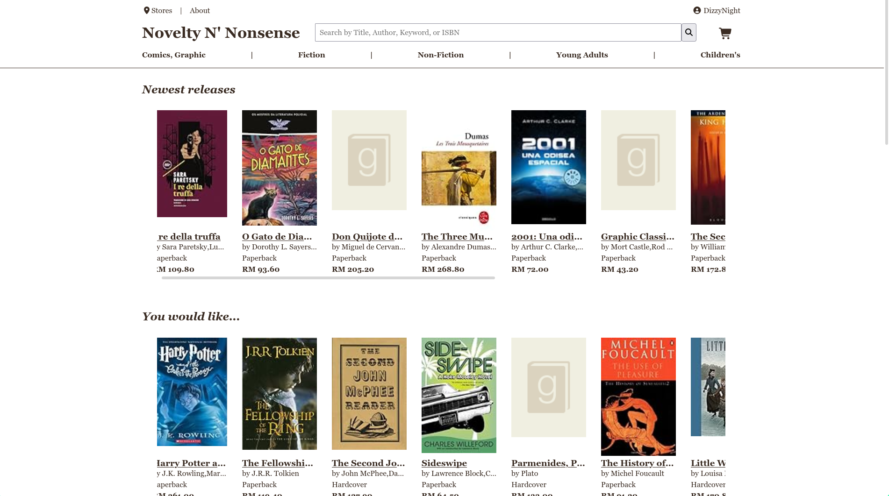

Novelty N' Nonsense Bookstore
=============================

A website for a bookstore storefront with admin dashboard for management.



About the Project
-----------------

Novelty N' Nonsense is a fictional bookstore that primarily sells books in
various format, catering to casuals and book lovers alike.

The project is a college assignment for a web class, built with no-framework php
with MariaDB. Due to the constraints, this project has its own:
- ORM (Query Builder & Object Mapping)
- Router
- Template Engine

Deployment
----------

### Docker

Make sure [Docker](https://www.docker.com/) is installed and running.

Make a copy of the file [.env](./.env), name it `.env.local`, and fill in the values for
the environment variables.

Then run

```shell
docker compose -f docker-compose.yml -f docker-compose.dev.yml up -d
# or for production
docker compose -f docker-compose.yml -f docker-compose.prod.yml up -d
```

The website would then be accessible from https://localhost

### XAMPP

Run the command inside of [/web](./web) directory. (cd if not already in it)

```shell
php -S localhost:8000 -t ./public
```

The website is accessible from http://localhost:8000

Contributing
------------

Contributions are **NOT** encouraged as this is a college assignment for a class that
will be evaluated. For teammates, refer to [CONTRIBUTING.md](./CONTRIBUTING.md) for
guidelines on contributing to the project.

<sub>I wrote this section for fun lol.

License
-------

Distributed under the [Apache 2.0](https://choosealicense.com/licenses/apache-2.0/) License. See [LICENSE.txt](./LICENSE) for more information.
